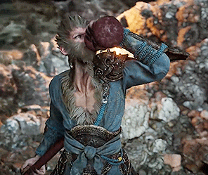

<table width="100%" style="border: 5px solid; border-color: red;">
<tr>
<td width="70%" valign="top">
  
 

  

  
<h4 style="font-family: Impact, sans-serif;">👋 Hello, Stranger!</h4>

<i>“Build things that matter in future.”</i>

---

 

  
<i>
📚 BSc in SWE @ DIU • Backend Development • AI Development 
💻 Programming • DevOps • MLOps • AI Architecture • Scientific Research 
🎮 Games • Sports • Music • Movies • TV-Series
</i>

 
 

  

  

</td>

<td width="30%" align="center" valign="top">

  

  

</td>

</tr>

</table>
